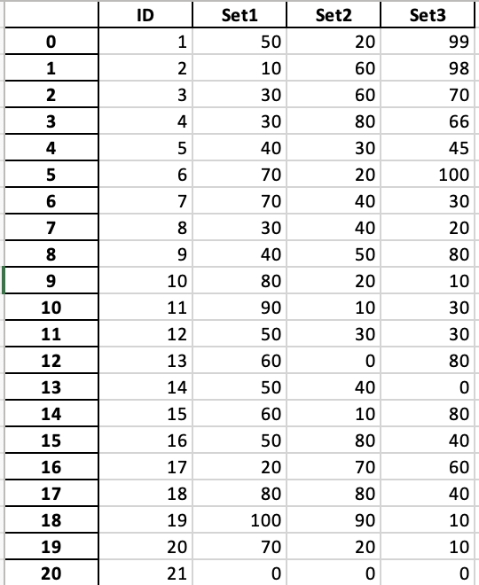
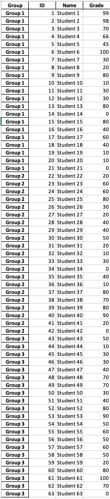

# ExcellecxE

### About

This application helps in merging several similar excel sheets that contain different information into one. It helps school and university teachers gather data about exams or group activities into one for easier analysis. This applies to other disciplines that have similar need.

There is a great potential to gradually develop this project until it is a very useful excel files utility. This initial project will act as the starting seed.

### Prerequisites

Python 3 is needed to run this script. The required packages are listed in the requirements.txt file at the main directory of the repository.

### Application Instructions

The first option is to merge several excel sheets into one. For example, if you have several test results for the same group of students and each exam has its own excel sheet. This is illustrated in the following example. Here there are three tests for the same group of students and we want to merge them in one excel sheet. You just need to place all the test sheets in the **Files for merging** folder and run the **merge.py** script.

  

The output will be called **'Summary_merged'** and it will look like this:

The second option is to append several excel sheets into one. For example, if you have test results or group activity data spread into several excel sheets. This is illustrated in the following example. Here there are three groups with different students and we want to append all the excel sheets into one. You just need to place all the test sheets in the **Files for appending** folder and run the **append.py** script.

  

The output will be called **'Summary_appended'** and it will look like this:

### Built Using
  - [Python 3.9](https://www.python.org) - Interpreted programming language.
### Author
  - [@drmohammadatieh](https://github.com/drmohammadatieh) - Idea & Implementation.
  
### License [MIT](https://github.com/drmohammadatieh/Excellecxe/blob/main/LICENSE)
